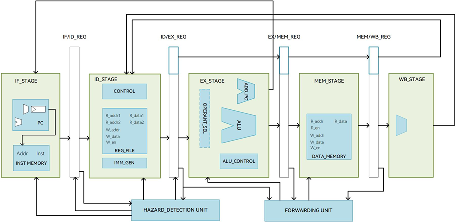
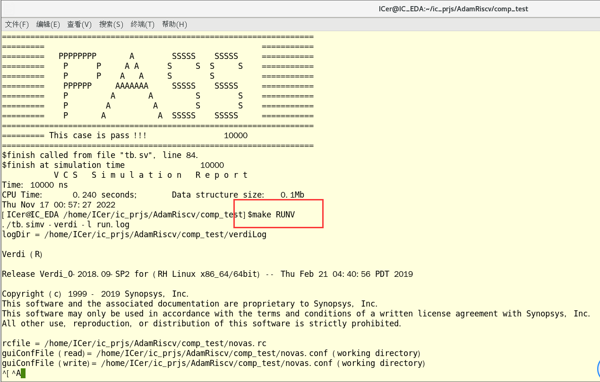
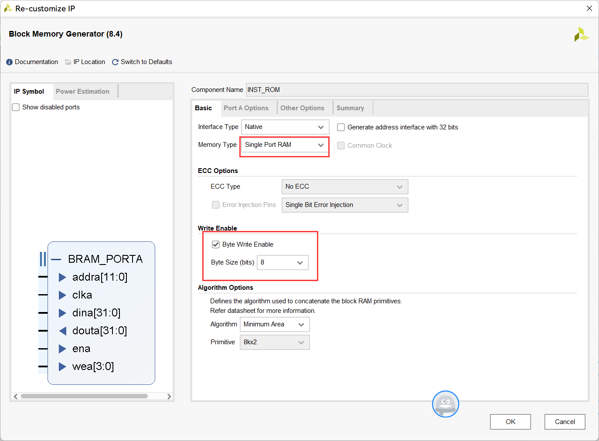

# AdamRiscV

# 简介

兼容RV32I的标准五阶流水线CPU，主要参照《计算机组成与设计 硬件/软件接口 RISCV版》中的教程所设计。项目网址：
[AdamRiscV-Gitee](https://gitee.com/adam-wu1999/AdamRiscv);
[AdamRiscV-Github](https://github.com/AdamWu1999/AdamRiscv)

---

# Version 1.2 更新日志

## 主要改进

1. IROM、DATA_RAM从原先的异步读Memory更换为同步读Memory，提供三种Memory可选：MC_MACRO（memory compiler库，但功能仿真下暂不可用）* 、REG_ARRAY（手写单端SRAM）* 、BRAM IP。支持在FPGA中综合为BRAM而不会被综合成LUTRAM，大幅度改善资源与性能。此外，为了抵消换用同步读RAM所造成的读取延迟，修改了流水站中涉及Memory读取的部分设计。（*：来自芯王国CK_Riscv）
2. 将原先设计中对Store指令的前递整合至EX阶段Rs2的前递中，增加针对Load(Rd)=Store(Rs2)的前递（即memory内数据复制的操作）。这么做是因为之前对书中的这段话理解有误。
    
3. 将寄存器的同步复位替换为异步复位，并增加异步复位同步释放模块。
4. 增加了两个基于VCS+Verdi的自动化testbench。一个是修改自芯王国CK_Riscv的tb，可实现针对不同指令类型的测试；另一个是由v1.0版本中的tb进一步完善而来，实现对37条指令与程序相关性的综合测试，且新的tb可由Golden文本自动生成结果检测task。
5. 增加了FPGA模式，该模式下使用BRAM IP实现memory并增加连接板卡的LED接口。在黑金AX7350板卡上实测通过，主频最高达110Mhz。
6. 修正了硬件设计中区分分支跳转指令的错误，修正了Golden、rom程序中的错误，修复了仿真打印trace中部分信息位置出错的bug

## Version 1.2.2
1. 修正了前递中的bug（位于stage_ex的分支地址计算）. 在 test2.s 中增加了对 jarl 指令的前递测试程序
2. comp_test 模式中增加了覆盖率检查的命令，在编译与执行完成之后可以 make COV 来使用verdi查看覆盖率

## 未来开发前(wā)瞻(kēng)

1. 增加总线与UART等外设模块
2. 增加一些调试特性（maybe JTAG？）
3. 增加支持的指令
4. 完善指令兼容性测试与覆盖率检测
5. 完成DC综合

---

# 使用手册

## 1 工程目录结构总览

- module：RTL设计文件与编译用file_list
    
    
- libs：SRAM库
    
    --MC_MACRO：由memory compiler导出的库，但功能仿真下暂不可用
    
    --REG_ARRAY：基于二维数组实现的手写单端同步读写SRAM
    
- verification：是修改自CK_Riscv项目的指令分类测试验证平台
    
    --cases：各类指令的测试用例目录，包含c程序、汇编程序、tb测试部分
    
    --regress_fun：Regress回归目录，包含编译、仿真的makefile与配置文件、路径指定文件
    
    --testbench：仿真所需额外文件（tb的另一部分）
    
- scripts：是运行指令分类测试验证平台所需的perl脚本包
    
    
- comp_test：是v1.0中的tb进一步完善而来的综合性测试验证平台，包含tb、makefile与所需脚本
    
    
- rom：综合性测试tb及FPGA模式所需的软件程序与对应golden，以及生成初始化固件所需的脚本
    
    
- fpga：包含开启FPGA模式的define声明、管脚约束文件、以及FPGA模式下的仿真tb
    
    

## 2 硬件设计简介

### 2.1 硬件架构图

硬件架构图如下（只显示主要模块与信号）：

### 2.2 相关指标

- 标准五阶流水线
- 顺序发射、顺序执行、顺序写回
- 哈佛架构
- 实现的特权态：M态
- 实现的指令：RV32I中除了控制状态寄存器指令、fence、ecall等杂项指令外的其余37条指令

    

- **不支持非对齐地址**
- 无分支预测，跳转发生后会flush流水站，产生两拍的空泡
- 含有前递通路，存在数据相关时，Load指令与其后的Store指令不需要停顿，Load指令与除Store外的指令仅需停顿1拍；Load指令外的其余指令之间存在数据相关时也无需停顿

## 3 指令分类测试TB

### 3.1 环境配置

需要****RISCV工具链、VCS、Verdi、perl。****

具体使用教程可参考，本使用手册仅对该平台补充一些我自己的理解。[CK_Riscv: 简易的RISC-V五级流水线标量处理器：CK_RISCV； 支持RV32I指令集，使用Veriog编写，简单易懂； 参照公司研发环境，设计一套规范的设计与验证环境； - Gitee.com](https://gitee.com/Core_Kingdom/CK_Riscv/tree/master#https://gitee.com/link?target=https%3A%2F%2Fblog.csdn.net%2Fweixin_40377195%2Farticle%2Fdetails%2F125345914%3Fspm%3D1001.2014.3001.5501)

也可以直接使用芯王国的虚拟机。

### 3.2 目录解析

- scripts：scripts中存放着众多可在终端中联动多个工具的perl脚本，如regress、openverdi。这些脚本需要在工程根目录下source bashrc.env，source完即可在这个终端中直接将这些脚本当命令调用。
    
    
    
- verification：其中包含了testbench、cases、regress_fun三个部分
    
    
    

### 3.3 魔改指南

- 设计的RTL目录下需要自行准备一个file_list并在其中写好该目录下要使用的所有文件名。
- 更改DUT后，需要检查并修改/cases下所有user.sv中的DUT层次结构、/regress_fun/module_list中的文件路径、environment.sv中的层次结构、/regress_fun/coverage.cfg中的结构层次以及instance文件中的DUT例化信息。
- 若设计中包含include时，需要在sim_config中调用vcs时加入+incdir选项以及相应的include文件检索目录的路径（使用相对路径的话要注意是以VCS工程目录为主目录），open_verdi中调用verdi时也要加入+incdir选项（可以加在file_list.f中）。

## 4 综合测试TB

### 4.1 环境配置

需要****RISCV工具链、VCS、Verdi、Python3。****

### 4.2 目录解析

- comp_test：是v1.0中的tb进一步完善而来的综合性测试验证平台，包含tb、makefile与所需脚本
    - makefile：包含编译命令COMP、执行仿真命令（分无GUI版RUN与Verdi版RUNV）。调用COMP后会自动先调用./load_list.py、./GoldenToTb.py、../rom/gen_hex.sh生成所需的文件，再启动VCS。
    - load_list.py：Python脚本，拷贝设计文件目录中的file_list里的信息，并添加+incdir+[路径]、+define [SRAM模式]、+libext+[SRAM路径]等相关编译选项，生成MAKE COMP中所需的module_list文件。
    - GoldenToTb.py：Python脚本，解析../rom/golden.txt文本，生成test_content.sv，即运行的软件所对应的测试用例。
    - tb.sv：tb主体，包含DUT例化、fsdb生成、程序写入IROM、结果显示等，其中include了测试用例文件test_content.sv。
- rom：包含综合测试平台中软件程序以及将程序转为memory初始化文件所需的脚本
    - gen_hex.sh：bash脚本，参数为要用的汇编程序文件名，调用RISCV工具链将汇编程序转为main_s.o、反编译文件main_s.dump、memory初始化文件main_s.verilog。
    - HexToCoe.py：Python脚本，在FPGA模式下使用。会将$readmemh() 所用的初始化文件main_s.verilog转为BRAM初始化用的Coe文件main_s_fpga.coe。
    - test2.S：汇编程序，是综合测试平台的默认程序，可测试37条指令的功能，并可测试指令之间存在数据相关的情况以及部分有符号数指令对负数的运行情况。在FPGA模式下，只有程序正确执行至last_test段才会点亮LED灯。
    - test1.S：汇编程序，简易版的测试程序，只测试10余条核心指令的运行情况。
    - golden.txt：所使用的汇编程序的最终运行结果。如需修改程序请记得按格式要求修改golden里的内容。

### 4.3 使用方法

打开终端，进入comp_test文件夹运行`make COMP`就会自动编译。

再运行`make RUN`即可仿真。终端中会打印硬件运行情况与测试结果。显示“PASS”即为测试通过，否则会显示“FAIL”字样。

若需开启Verdi，则在仿真的时候改用`make RUNV`即可。

## 5 FPGA模式

### 5.1 使用方法

除了导入硬件设计文件外还需进行以下步骤：

1. 添加./fpga/FPGA_MODE.vh文件并将其设置为Global include，以开启FPGA模式
2. 在IP Catalog中打开Clocking Wizard创建时钟IP，只需要in、out两个端口即可，确保部件名称与图中一致（clk_wiz_0）。输入的时钟频率根据自己的板卡来确定。输出的时钟频率不超过110Mhz（主要还是根据板卡自己调）。

    

3. 在IP Catalog中打开Block Memory Generator创建两个BRAM IP，分别命名为INST_ROM、DATA_RAM。两个BRAM设置的参数均如下：

    

    

    对于INST_ROM，还需要额外设置初始化选项。先运行./rom/HexToCoe.py生成Coe文件，再在下图选项中添加Coe文件路径。勾选Fill Remaining Memory Location 并填写0，将空余的memory用0填充。

    

4. 添加xdc约束文件，此文件需根据自己的板卡来编写
5. 添加./fpga/tb_fpga.v，可进行FPGA模式下的仿真。（该模式不会自动由golden生成测试用例）

---

# 参考项目推荐

1. [CK_Riscv: 简易的RISC-V五级流水线标量处理器：CK_RISCV； 支持RV32I指令集，使用Veriog编写，简单易懂； 参照公司研发环境，设计一套规范的设计与验证环境； - Gitee.com](https://gitee.com/Core_Kingdom/CK_Riscv/tree/master#https://gitee.com/link?target=https%3A%2F%2Fblog.csdn.net%2Fweixin_40377195%2Farticle%2Fdetails%2F125345914%3Fspm%3D1001.2014.3001.5501)
2. [tinyriscv: 一个从零开始写的极简、非常易懂的RISC-V处理器核。 (gitee.com)](https://gitee.com/liangkangnan/tinyriscv)